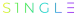
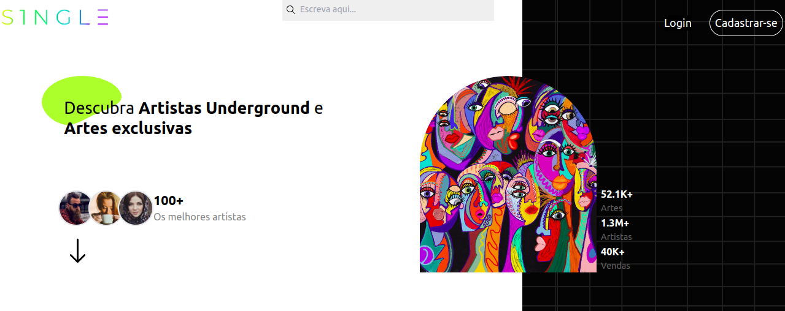
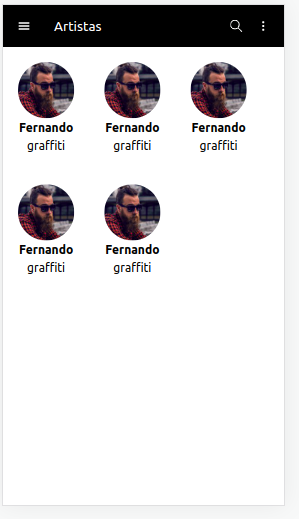
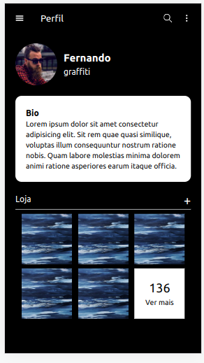
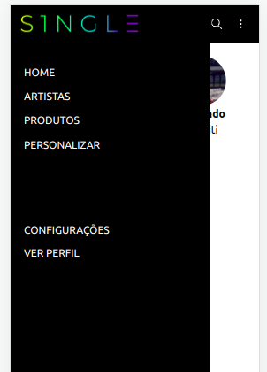

# S1NGLE 🎨

[![tailwind-badge][tailwind-shield]][tailwind]
[![react-badge][react-shield]][react]
[![redux-badge][redux-shield]][redux]

[tailwind-shield]: https://img.shields.io/badge/Style-Tailwind-blue
[tailwind]: https://tailwindcss.com/

[react-shield]: https://img.shields.io/badge/React-v18.2-lightblue
[react]: https://reactjs.org/

[redux-shield]: https://img.shields.io/badge/Redux%20Toolkit-%20v1.9-purple
[redux]: https://redux-toolkit.js.org/

---

## Status do projeto:
Em andamento... ⚠️

## Índice 📖
* __[Descrição](#description)__
* __[Tecnologias](#technologies)__
* __[Telas](#screens)__

---

## Descrição 📌 
S1ngle é o lugar onde artistas underground e amantes de arte podem se cadastrar e divulgar suas artes e marca para o público!

---

## Tecnologias 💻 
* React.js
* React hooks & React router
* Redux Toolkit
* Tailwind CSS
* Jest & React Testing Library

---

## Screens 🖼️ 

### Landpage

### Artistas

### Perfil do artista

### NavBar
